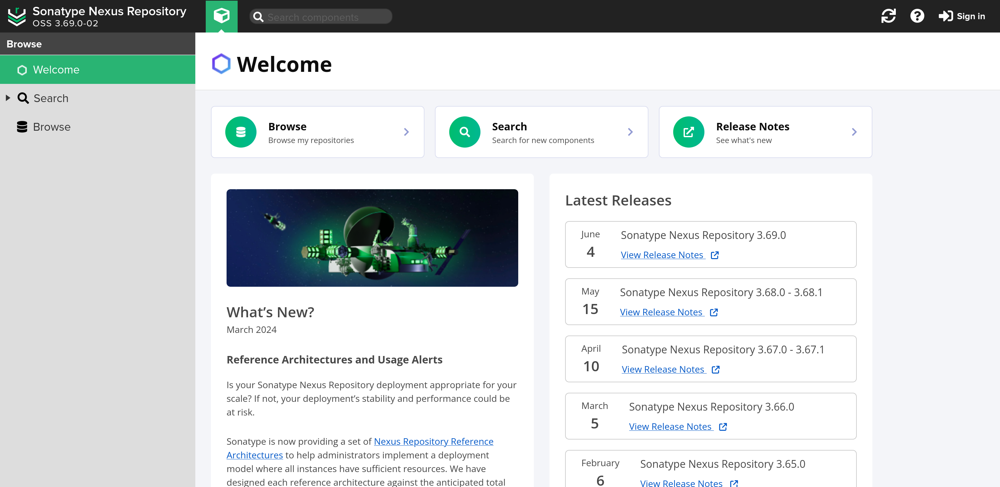
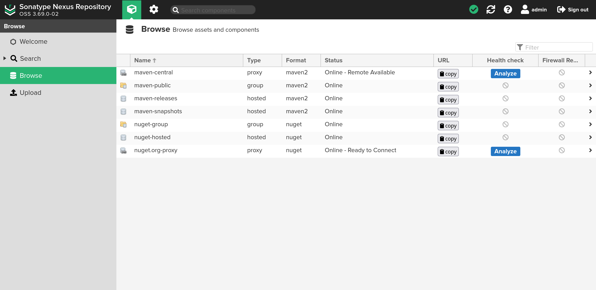
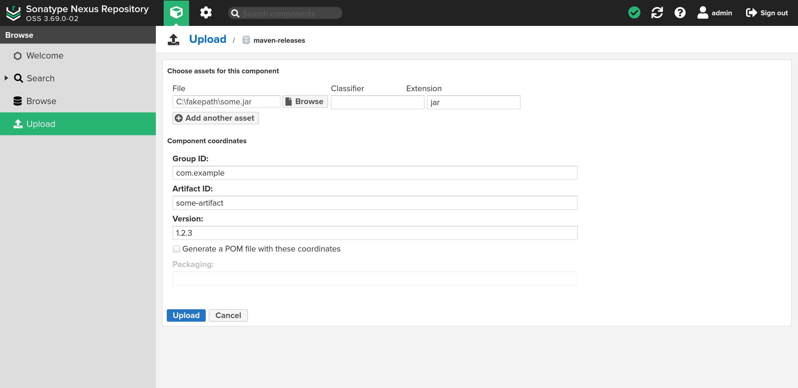

# Triển khai và sử dụng Nexus Repository cho maven

### Triển khai Nexus Repository trên Docker

#### Yều cầu

- Môi trường linux
- Đã cài đặt docker, docker compose

#### Các bước thực hiện

- Tạo thư mục mới với tên bất kỳ, ví dụ:
  ```bash
  mkdir nexus-repo
  cd nexus-repo
  ```
- Tạo thư mục `nexus-data` và thêm quyền write cho thư mục này:
  ```bash
  mkdir nexus-data
  chmod o+w nexus-data
  ```
  Bước này là cần thiết do người dùng trong container sẽ không có quyền root.
- Tạo file docker-compose.yaml hoặc compose.yaml với nội dung:
  ```yaml
  services:
    nexus:
      image: sonatype/nexus3
      ports:
        - "8081:8081"
      volumes:
        - ./nexus-data:/nexus-data
  ```
- Chạy docker compose:
  ```bash
  docker compose up -d
  ```
  Có thể mất một vài phút trước khi server online. Sử dụng `docker logs -f nexus-repo-nexus-1` hoặc xóa bỏ `-d` để theo dõi logs.
- Truy cập giao diện web tại `http://localhost:8081`:
  
- Đăng nhập tài khoản admin:
  Chọn Sign in và đăng nhập với tài khoản `admin` và mật khẩu nằm trong file `./nexus-data/admin.password`. Sau khi đăng nhập, đặt mật khẩu admin mới và chọn `Enable anonymous access`.

Truy cập vào mục Browse để xem dach sách các repository mặc định. Nexus 3 đã tạo sắn 4 repo maven và 3 repo nuGet.



`maven-central` là một proxy đến [Maven Central Repository](https://mvnrepository.com/repos/central) sử dụng mặc định bởi maven. `maven-releases` chứa các package do người dùng tải lên và `maven-snapshots` chứa các package `-SNAPSHOT`. `maven-public` là tổng hợp cả 3 repo phía trên.

### Cài đặt maven để sử dụng Nexus

#### Cách 1: Sử dụng pom.xml

Cách này cho phép maven download các package từ nexus bên cạnh maven-central mặc định.

Thêm vào `pom.xml`:
```xml
<project ...>
  ...
  <repositories>
    <repository>
      <id>nexus</id>
  	  <name>maven-public</name>
  	  <url>http://localhost:8081/repository/maven-public/</url>
    </repository>
  </repositories>
  ...
</project>
```

Link trong `<url></url>` cần khớp với link trong cột URL trên giao diện Browse.

Nếu có nhiều project cần truy cập nexus, `pom.xml` cần được config cho từng project.

#### Cách 2: Sử dụng settings.xml:

Cách này cho phép maven truy cập nexus từ mọi project mà không cần chỉnh sửa `pom.xml`. Đồng thời cho phép sử dụng profile để chuyển hướng mọi request từ maven-central sang nexus.

Tạo file `~/.m2/settings.xml` nếu chưa có sẵn:
```xml
<settings xmlns="http://maven.apache.org/SETTINGS/1.0.0"
  xmlns:xsi="http://www.w3.org/2001/XMLSchema-instance"
  xsi:schemaLocation="http://maven.apache.org/SETTINGS/1.0.0 https://maven.apache.org/xsd/settings-1.0.0.xsd">
  <mirrors>
    <mirror>
      <!--This sends everything else to /public -->
      <id>nexus</id>
      <mirrorOf>*</mirrorOf>
      <url>http://localhost:8081/repository/maven-public/</url>
    </mirror>
  </mirrors>
  <profiles>
    <profile>
      <id>nexus</id>
      <!--Enable snapshots for the built in central repo to direct
        all requests to nexus via the mirror -->
      <repositories>
        <repository>
          <id>central</id>
          <url>http://central</url>
          <releases>
            <enabled>true</enabled>
          </releases>
          <snapshots>
            <enabled>true</enabled>
          </snapshots>
        </repository>
      </repositories>
      <pluginRepositories>
        <pluginRepository>
          <id>central</id>
          <url>http://central</url>
          <releases>
            <enabled>true</enabled>
          </releases>
          <snapshots>
            <enabled>true</enabled>
          </snapshots>
        </pluginRepository>
      </pluginRepositories>
    </profile>
  </profiles>
  <activeProfiles>
    <!--make the profile active all the time -->
    <activeProfile>nexus</activeProfile>
  </activeProfiles>
</settings>
```

#### Download package từ nexus

Các package có thể được download từ giao diện web hoặc được khai báo trong `pom.xml` như thông thường.

```xml
<dependency>
  <groupId>com.example</groupId>
  <artifactId>artifact</artifactId>
  <version>1.0.0</version>
</dependency>
```

### Upload package lên nexus

#### Cách 1: Upload thủ công

Đăng nhập tài khoản admin hoặc bất kỳ tài khoản nào có đủ quyền upload component. Truy cập vào Upload, chọn maven-releases sau đó tải lên file jar và điền đầy đủ các metadata theo yêu cầu.



#### Cách 2: Deploy từ maven

Tài khoản admin có đầy đủ quyền để upload lên nexus. Tuy nhiên, để tăng bảo mật chúng ta nên tạo một người dùng chỉ có đủ quyền để deploy lên các repo cho phép.

- Truy cập vào trang Admin (hình bánh răng), trong mục *Security*, chọn *Roles* -> *Create Role* và điền các thông tin như bên dưới. Sau đó chọn Save.
  | Field | Value |
  |---|---|
  | Type | Nexus role |
  | Role ID | nx-deployment |
  | Role Name | nx-deployment |
  | Applied Privileges | nx-repository-view-maven2-maven-releases-\*, nx-repository-view-maven2-maven-snapshots-\* |

- Truy cập vào *Users*, chọn *Create local user* và điền thông tin như sau, tất nhiên nên thay đổi mật khẩu và các thông tin khác nếu cần thiết.
  | Field | Value |
  |---|---|
  | ID | deployment |
  | First name | Deployment |
  | Last name | User |
  | Email | deployment@example.com |
  | Password | deployment123 |
  | Status | Active |
  | Roles | nx-deployment |

Thêm plugin `nexus-staging-maven-plugin` vào `pom.xml`:

```xml
  <plugins>
    ...
    <plugin>
      <groupId>org.apache.maven.plugins</groupId>
      <artifactId>maven-deploy-plugin</artifactId>
      <version>${maven-deploy-plugin.version}</version>
      <configuration>
        <skip>true</skip>
      </configuration>
    </plugin>
    <plugin>
      <groupId>org.sonatype.plugins</groupId>
      <artifactId>nexus-staging-maven-plugin</artifactId>
      <version>1.7.0</version>
      <executions>
        <execution>
          <id>default-deploy</id>
          <phase>deploy</phase>
          <goals>
            <goal>deploy</goal>
          </goals>
        </execution>
      </executions>
      <configuration>
        <serverId>nexus</serverId>
        <nexusUrl>http://localhost:8081/</nexusUrl>
      	<skipStaging>true</skipStaging>
      </configuration>
    </plugin>
    ...
  </plugins> 
```

Lưu ý cập nhật phiên bản của `nexus-staging-maven-plugin` cho phù hợp với phiên bản nexus đang sử dụng. Thông thường, phiên bản plugin mới nhất sẽ luôn tương thích với phiên bản nexus mới nhất.

Thêm địa chỉ nexus vào `pom.xml`:

```xml
<project ...>
  ...
  <distributionManagement>
    <repository>
      <id>nexus-releases</id>
      <url>http://localhost:8081/repository/maven-releases/</url>
    </repository>
    <snapshotRepository>
      <id>nexus-snapshots</id>
      <url>http://localhost:8081/repository/maven-snapshots/</url>
    </snapshotRepository>
  </distributionManagement>
  ...
</project>
```

Tài khoản và mật khẩu được config trong `~/.m2/settings.xml`:

```xml
<settings ...>
  ...
  <servers>
    <server>
      <id>nexus-releases</id>
      <username>deployment</username>
      <password>deployment123</password>
    </server>
    <server>
      <id>nexus-snapshots</id>
      <username>deployment</username>
      <password>deployment123</password>
    </server>
  </servers>
  ...
</settings>
```

Để deploy project hiện tại lên nexus, chạy:

```bash
mvn clean deploy
```

**Lưu ý:** Sử dụng `clean` để tránh upload những artifact được build bởi các phiên bản khác của project.

maven sẽ tự động lựa chọn releases hoặc snapshots dựa vào đuôi `-SNAPSHOT` trong `<version></version>`.
